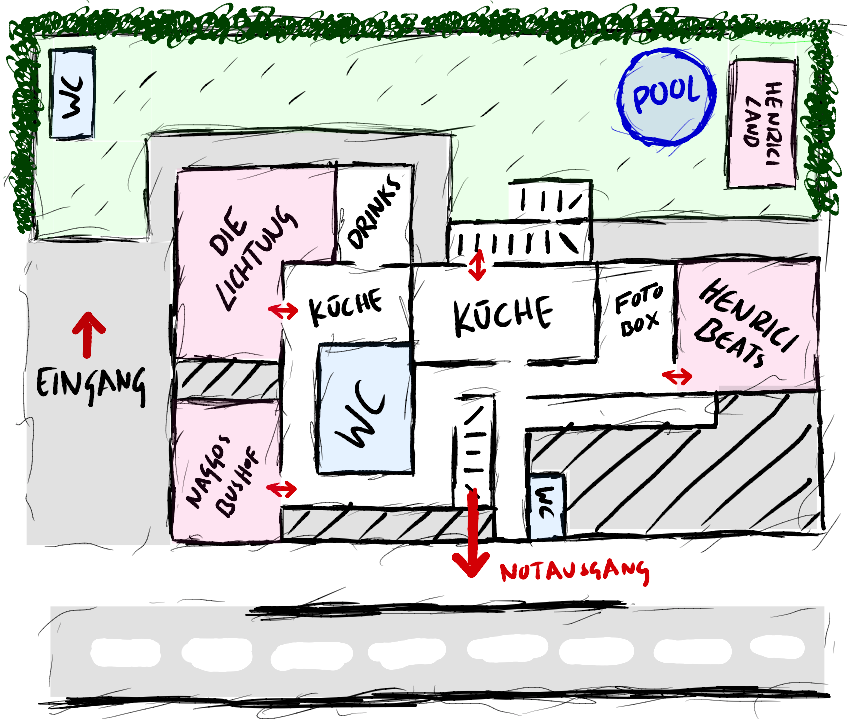

## Floorplan

## Timetable
| Zeit  | Henriciland             | Genre                    | Henrici Beats           | Genre                    | Techno La Cola          | Genre                    | Naggos Bushof           | Genre                    |
|:------|------------------------:|:-------------------------|------------------------:|:-------------------------|------------------------:|:-------------------------|------------------------:|:-------------------------|
| 14:00 | Ballerbenni Ultrabock   | 🏝 Ballermann Supermix   |                         |                          |                         |                          |                         |                          |
| 15:00 | DJ Loco                 | 💃 Reggaeton & Hip Hop   |                         |                          |                         |                          |                         |                          |
| 16:00 | Kings Corner            | 🎤 **Live**              |                         |                          |                         |                          |                         |                          |
| 17:00 | DJ Loco                 | 🕺 Reggaeton & Hip Hop   |                         |                          |                         |                          |                         |                          |
| 18:00 | Glückskind              | 🔋 Electrochill          | Benni & Mary            | 🕺 80s                   |                         |                          |                         |                          |
| 19:00 | Lobomusic               | 🎛 **Vinyl Set**         |                         |                          |                         |                          |                         |                          |
| 20:00 | Clean Josef             | 🎷 Jazz House            | DJ Loco                 | 🚔 Hip Hop               |                         |                          | Nacho                   | 🧑‍🎤 Indie & Punk          |
| 21:00 | Tunnel Michi            | 🎶 Vocal & Melodic House |                         |                          | Micha & Jonas           | ⚡️ Techno                | Joel                    | ⚙️ Techno                |
| 22:00 |                         |                          | Yolonas                 | 🌈 Querbeats             |                         |                          |                         |                          |
| 23:00 |                         |                          |                         | 👑 Hip Hop & Trap        | Lobomusic               | 🎵 Melodic Techno        | DJ Pauli                | 🚌 radiate love          |
|  0:00 |                         |                          | ❓                      |❓                        |                         |                          | Basstey                 | 🕶 Tech House            |
|  1:00 |                         |                          |                         |❓                        | Jonas Halter & Ex Ante  | ✨ Drum & Bass           |                         | 🎧 Progressive Techno    |
|  2:00 |                         |                          | DJ Loco                 | 🔫 Hip Hop               |                         | 🧨 Hard Techno           | Schmierjlappen          | 🧨 Techno                |
|  3:00 |                         |                          |                         | 🔫 Hip Hop               | Tunnelmichi             | 🪄 Bass House            |                         |                          |
|  4:00 |                         |                          |                         |                          | Clean Josef             | 🎧 Techno                | ❓                      | ❓                       |
